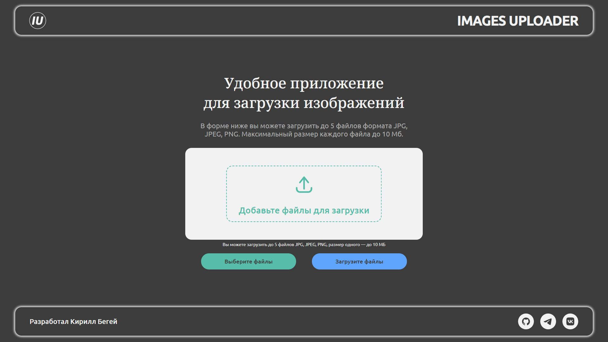

# Проект "Images Uploader" – Веб-приложение для загрузки изображений

## О проекте

**Images Uploader** — это веб-приложение для загрузки изображений форматов jpg, jpeg, png. Пользователи могут добавлять изображения, проверять их на валидность и сортировать их с помощью технологии Drag-and-Drop. Приложение построено с использованием JavaScript и принципов ООП, с кастомным input для загрузки изображений и поддержкой многократной загрузки файлов.

Проект реализован с использованием Webpack для сборки и включает в себя:
- Валидацию изображений.
- Отображение лоадеров и сообщений.
- Возможность сортировки изображений через Drag-and-Drop.

## Превью проекта



## Ссылка на демо

- [Посмотреть сайт](https://iu-project.vercel.app/)

## Статус проекта

Проект завершён.

## Функциональность

- **Загрузка изображений**: Возможность загрузки изображений форматов jpg, jpeg, png.
- **Валидация изображений**: Проверка формата изображений до загрузки.
- **Сортировка изображений**: Перетаскивание изображений для изменения порядка.
- **Кастомный input type="file"**: Многократная загрузка файлов с валидацией.
- **Отображение сообщений**: Вывод сообщений об ошибках или успешной загрузке.
- **Лоадеры**: Показ анимации загрузки.
- **Адаптивная вёрстка**: Интерфейс адаптирован под различные размеры экрана.

## Технологии и инструменты

- **HTML5** — Семантическая структура страницы.
- **CSS3** — Стилизация с использованием классов и методов.
- **JavaScript (ES6+)** — Логика приложения, ООП-подход.
- **Webpack** — Сборка проекта.
- **ESLint** — Линтинг кода по стандартам airbnb.
- **Drag-and-Drop API** — Реализация сортировки изображений.

## Запуск проекта

1. Клонируйте репозиторий:

   ```bash
   git clone https://github.com/kirill-io/Images-Uploader-project.git
   ```

2. Перейдите в директорию проекта:

   ```bash
   cd iu-project
   ```

3. Установите зависимости:

   ```bash
   npm install
   ```

4. Запустите проект в режиме разработки:

   ```bash
   npm run start
   ```

5. Для сборки проекта:

  - Режим разработки:
    ```bash
    npm run build:dev
    ```

  - Production-сборка:
    ```bash
    npm run build:prod
    ```

## Проверка кода
  - ESLint (airbnb-base) — Проверка JavaScript:
    ```bash
    npm run lint:js
    npm run lint:js:fix
    ```

  - Stylelint (scss) — Проверка стилей:
    ```bash
    npm run lint:scss
    npm run lint:scss:fix
    ```
